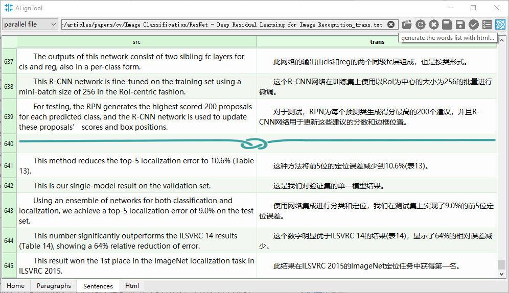

# Introlduction To My AlignTool

Currently I'm using PyQt5 to build the GUI of my `AlignTool`, There are many tools(`ABBYY Aligner`, `WinAlign`, `Tmxmall`, etc.) available, why do I waste the energy to `reinventing the wheel`?

Well, I try some of them, and they're not convient. Most of the users have to accustom themself and endure the unconvience, but I, as a programer, have enough experience to build a toy demo and the refine the toy until finally meeting the pratical needs.

## Introduction

We can choose the file type to process, either a file containing paralell language or two separate files. What's more, We can load a single file containing only one language, then use the online translation api to generate Chinese transcription.

Here, I write a crawler to crawl data from `https://fanyi.qq.com/api/translate`. Due to the length limitation, I chunck the source content into around 1024 characters.

A progress bar shows when loading, re-loading, busy processing.

Sometimes the text may contain errors, so I use some simple rules to check and hilight the wrong(suspicious) part.

Edit the paragraph. Sometimes the order of the paragraphs is not right, just selet some cells and drag-and-drop to change the order. 

The sentences processing is very similar to paragraph level. The processing unit is smaller, so I use a bar to separate each paragraph.

I can generate a friendly html file to read the article and recite the new words.

## TODO

1. reimplement it with C++, use the virtual-list or lazy-loading or the adapter to handle large data.

2. add a word management tab to store and read data from database such as sqlite.
